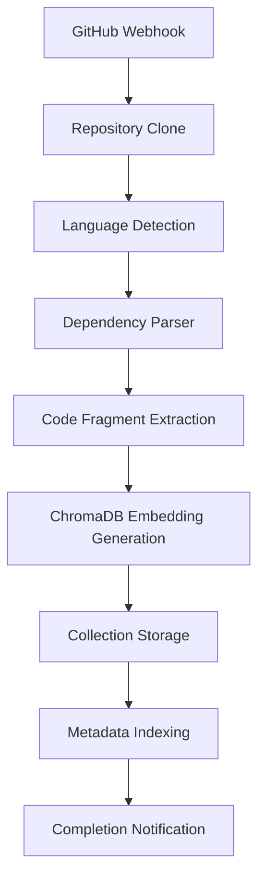

# Arquitectura Técnica - Sistema de Índice de Dependencias

## Visión General Arquitectónica

El Sistema de Índice de Dependencias (DIS) está construido sobre una arquitectura serverless que integra profundamente ChromaDB como el motor principal de almacenamiento y búsqueda semántica. La arquitectura sigue los principios del patrón Event-Driven Architecture (EDA) y utiliza ChromaDB para proporcionar capacidades de análisis semántico avanzadas.

## Principios Arquitectónicos

### 1. ChromaDB-First Design
- **Almacenamiento Semántico Nativo**: Todas las dependencias se almacenan como embeddings vectoriales
- **Búsqueda Semántica Primaria**: ChromaDB es el motor principal para consultas de dependencias
- **Colecciones Organizadas**: Estructura lógica de colecciones por repositorio y tipo de datos
- **Metadatos Enriquecidos**: Aprovechamiento completo de las capacidades de metadata de ChromaDB

### 2. Serverless-Native
- **Escalabilidad Automática**: Funciones Lambda que escalan según demanda
- **Pago por Uso**: Costos optimizados basados en utilización real
- **Estado Mínimo**: Diseño stateless con estado persistido en ChromaDB y DynamoDB

### 3. Event-Driven Processing
- **Desacoplamiento**: Componentes comunicados via SQS y eventos
- **Procesamiento Asíncrono**: Operaciones pesadas ejecutadas de forma asíncrona
- **Resiliencia**: Patrones de retry y dead letter queues

## Componentes Arquitectónicos

### Core Components

#### 1. Dependency Indexer Service

**Responsabilidad**: Análisis inicial y indexación completa de repositorios

```yaml
# Lambda Configuration
FunctionName: internal-nbx-dependency-indexer-lambda
Runtime: nodejs20.x
Memory: 2048MB
Timeout: 900s
```

**ChromaDB Integration**:
```javascript
// Collections Strategy
const collections = {
  dependencies: `dependencies-${repoId}`,
  codeFragments: `code-fragments-${repoId}`,
  fileStructure: `file-structure-${repoId}`,
  importGraph: `import-graph-${repoId}`
};

// Embedding Strategy
const embeddingModel = "all-MiniLM-L6-v2"; // Optimizado para código
const chunkSize = 512; // Tokens por fragmento de código
```

**Funcionalidades Principales**:
- Clonado seguro de repositorios desde GitHub
- Análisis multi-lenguaje de dependencias
- Generación de embeddings semánticos para ChromaDB
- Detección de patrones de arquitectura
- Indexación incremental para repositorios existentes

**Flujo de Procesamiento**:


#### 2. Dependency Analyzer Service

**Responsabilidad**: Análisis en tiempo real para Pull Requests

```yaml
# Lambda Configuration
FunctionName: internal-nbx-dependency-analyzer-lambda
Runtime: nodejs20.x
Memory: 1024MB
Timeout: 300s
```

**ChromaDB Query Patterns**:
```javascript
// Similarity Search para dependencias relacionadas
const similarDependencies = await chromaClient.query({
  collectionName: `dependencies-${repoId}`,
  queryTexts: [dependencyDescription],
  nResults: 10,
  where: { "category": { "$eq": "production" } }
});

// Vector Search para impacto de cambios
const impactAnalysis = await chromaClient.query({
  collectionName: `code-fragments-${repoId}`,
  queryTexts: [changedCode],
  nResults: 20,
  include: ["documents", "metadatas", "distances"]
});
```

**Capacidades de Análisis**:
- Detección de cambios en dependencias via diff analysis
- Búsqueda semántica de código afectado por cambios
- Análisis de impacto en múltiples archivos/módulos
- Detección de breaking changes potenciales
- Recomendaciones de testing basadas en impacto

#### 3. Dependency Updater Service

**Responsabilidad**: Mantenimiento y actualización del índice

```yaml
# Lambda Configuration
FunctionName: internal-nbx-dependency-updater-lambda
Runtime: nodejs20.x
Memory: 1024MB
Timeout: 900s
```

**ChromaDB Maintenance Operations**:
- Actualización incremental de embeddings
- Limpieza de colecciones obsoletas
- Re-indexación optimizada basada en cambios
- Backup y recovery de colecciones críticas

### Data Layer Architecture

#### ChromaDB Collections Design

**1. Dependencies Collection Schema**
```javascript
const dependencySchema = {
  // Vector embedding del nombre + descripción de la dependencia
  embedding: [float32Array], // Generado por sentence transformer
  
  // Documento original
  document: JSON.stringify({
    name: "express",
    version: "^4.18.0",
    description: "Fast, unopinionated, minimalist web framework",
    homepage: "http://expressjs.com/",
    repository: "https://github.com/expressjs/express"
  }),
  
  // Metadata estructurada para filtering
  metadata: {
    id: "express-4.18.0-abc123",
    name: "express",
    version: "4.18.0",
    type: "dependency", // dependency, devDependency, peerDependency
    category: "web-framework",
    language: "javascript",
    license: "MIT",
    lastUpdated: "2024-01-15T10:30:00Z",
    vulnerabilities: [],
    downloadCount: 50000000,
    maintainers: 15,
    isDeprecated: false,
    hasBreakingChanges: false,
    repository: "repo-123",
    filePath: "package.json",
    importedBy: ["src/app.js", "src/server.js"]
  }
}
```

**2. Code Fragments Collection Schema**
```javascript
const codeFragmentSchema = {
  // Embedding del fragmento de código normalizado
  embedding: [float32Array],
  
  // Fragmento de código con contexto
  document: JSON.stringify({
    code: "const express = require('express');\nconst app = express();",
    context: {
      beforeLines: ["// Server setup", "import dotenv from 'dotenv';"],
      afterLines: ["app.use(cors());", "app.listen(3000);"]
    },
    functionName: "setupServer",
    className: "ServerController"
  }),
  
  // Metadata para precise filtering
  metadata: {
    id: "fragment-xyz789",
    filePath: "src/server.js",
    startLine: 15,
    endLine: 17,
    language: "javascript",
    dependencies: ["express"],
    functionScope: "setupServer",
    complexity: "low",
    testCoverage: 85.5,
    lastModified: "2024-01-15T10:30:00Z",
    author: "developer@company.com",
    isTestFile: false,
    cyclomatic: 2,
    repository: "repo-123"
  }
}
```

**3. Vulnerability Database Collection Schema**
```javascript
const vulnerabilitySchema = {
  // Embedding de la descripción de vulnerabilidad
  embedding: [float32Array],
  
  // Detalles completos de la vulnerabilidad
  document: JSON.stringify({
    cveId: "CVE-2024-1234",
    title: "SQL Injection vulnerability in express-validator",
    description: "Improper input validation allows SQL injection attacks...",
    impact: "Critical - Remote code execution possible",
    solution: "Update to version 6.15.0 or apply patches",
    references: ["https://cve.mitre.org/...", "https://github.com/..."]
  }),
  
  // Metadata para alerting y filtering
  metadata: {
    id: "cve-2024-1234",
    cveId: "CVE-2024-1234",
    severity: "critical", // critical, high, medium, low
    cvssScore: 9.8,
    publishedDate: "2024-01-10",
    affectedPackages: ["express-validator"],
    affectedVersions: ["< 6.15.0"],
    fixedVersions: ["6.15.0", "7.0.0"],
    exploitExists: true,
    isInTheWild: false,
    lastUpdated: "2024-01-15T10:30:00Z",
    categories: ["injection", "validation"],
    platforms: ["nodejs", "javascript"]
  }
}
```

### Integration Architecture

#### ChromaDB Client Architecture

```javascript
// src/common/chromadb/client.js
class ChromaDBClient {
  constructor(config = {}) {
    this.config = {
      host: process.env.CHROMADB_HOST || 'localhost',
      port: process.env.CHROMADB_PORT || 8000,
      ssl: process.env.CHROMADB_SSL === 'true',
      auth: {
        provider: process.env.CHROMADB_AUTH_PROVIDER || 'none',
        credentials: process.env.CHROMADB_AUTH_CREDENTIALS
      },
      ...config
    };
    
    this.client = new ChromaClient({
      path: `http${this.config.ssl ? 's' : ''}://${this.config.host}:${this.config.port}`
    });
  }

  async initializeCollections(repoId, reset = false) {
    const collections = this.getCollectionNames(repoId);
    
    for (const [purpose, name] of Object.entries(collections)) {
      if (reset) {
        await this.safeDeleteCollection(name);
      }
      
      await this.createCollection({
        name,
        metadata: {
          purpose,
          repository: repoId,
          createdAt: new Date().toISOString(),
          schema: this.getSchemaForPurpose(purpose)
        },
        embeddingFunction: this.getEmbeddingFunction()
      });
    }
  }

  async semanticSearch(params) {
    const {
      collectionName,
      query,
      filters = {},
      limit = 10,
      includeDistance = true
    } = params;

    const results = await this.client
      .getCollection({ name: collectionName })
      .query({
        queryTexts: [query],
        nResults: limit,
        where: filters,
        include: ["documents", "metadatas", "distances"]
      });

    return this.processSearchResults(results, includeDistance);
  }

  async hybridSearch(params) {
    // Combina búsqueda semántica con filtros exactos
    const {
      collectionName,
      semanticQuery,
      exactFilters = {},
      semanticWeight = 0.7,
      limit = 10
    } = params;

    // Búsqueda semántica
    const semanticResults = await this.semanticSearch({
      collectionName,
      query: semanticQuery,
      filters: exactFilters,
      limit: limit * 2 // Obtener más resultados para re-ranking
    });

    // Re-ranking basado en multiple criterios
    return this.rerankResults(semanticResults, {
      semanticWeight,
      metadataBoosts: params.metadataBoosts || {}
    }).slice(0, limit);
  }
}
```

#### Embedding Strategy

**Model Selection**:
```javascript
const EmbeddingStrategy = {
  // Para código fuente y dependencias
  code: {
    model: "microsoft/codebert-base",
    dimensions: 768,
    context: "Code analysis and similarity detection"
  },
  
  // Para descripciones de texto y documentación
  text: {
    model: "sentence-transformers/all-MiniLM-L6-v2",
    dimensions: 384,
    context: "General text understanding"
  },
  
  // Para vulnerabilidades y issues de seguridad
  security: {
    model: "sentence-transformers/all-mpnet-base-v2",
    dimensions: 768,
    context: "Security and vulnerability analysis"
  }
};

// Preprocessing pipeline para diferentes tipos de contenido
class EmbeddingPreprocessor {
  static forCode(codeFragment) {
    return codeFragment
      .replace(/\/\*[\s\S]*?\*\//g, '') // Remove block comments
      .replace(/\/\/.*$/gm, '') // Remove line comments
      .replace(/\s+/g, ' ') // Normalize whitespace
      .trim();
  }
  
  static forDependency(dependency) {
    return `${dependency.name} ${dependency.description} ${dependency.keywords?.join(' ') || ''}`.trim();
  }
  
  static forVulnerability(vulnerability) {
    return `${vulnerability.title} ${vulnerability.description} ${vulnerability.impact}`.trim();
  }
}
```

### Performance Architecture

#### Query Optimization Patterns

**1. Collection Partitioning Strategy**
```javascript
// Particionamiento por repositorio y tipo
const getOptimalCollectionName = (repoId, dataType, size) => {
  if (size > 1000000) { // Para repos muy grandes
    return `${dataType}-${repoId}-${getDatePartition()}`;
  }
  return `${dataType}-${repoId}`;
};

// Índices compuestos para queries frecuentes
const createOptimizedIndexes = async (collection) => {
  await collection.createIndex({
    metadata: {
      language: 1,
      category: 1,
      lastModified: -1
    }
  });
};
```

**2. Caching Layer**
```javascript
class ChromaDBCacheLayer {
  constructor() {
    this.cache = new LRUCache({
      max: 1000,
      ttl: 1000 * 60 * 15 // 15 minutos
    });
  }

  async cachedQuery(queryHash, queryFn) {
    if (this.cache.has(queryHash)) {
      return this.cache.get(queryHash);
    }
    
    const results = await queryFn();
    this.cache.set(queryHash, results);
    return results;
  }

  generateQueryHash(params) {
    return crypto.createHash('md5')
      .update(JSON.stringify(params))
      .digest('hex');
  }
}
```

### Security Architecture

#### Authentication & Authorization

```javascript
class ChromaDBSecurityLayer {
  constructor() {
    this.tokenValidator = new JWTValidator({
      secret: process.env.CHROMADB_JWT_SECRET,
      algorithms: ['HS256']
    });
  }

  async validateAccess(token, operation, collectionName) {
    const payload = await this.tokenValidator.verify(token);
    
    // Repository-level access control
    const repoId = this.extractRepoId(collectionName);
    if (!payload.repositories.includes(repoId)) {
      throw new ForbiddenError('Access denied to repository');
    }
    
    // Operation-level access control
    if (!payload.permissions.includes(operation)) {
      throw new ForbiddenError(`Operation '${operation}' not allowed`);
    }
    
    return payload;
  }

  async auditLog(userId, operation, collectionName, metadata = {}) {
    await this.auditClient.log({
      timestamp: new Date().toISOString(),
      userId,
      operation,
      resource: collectionName,
      metadata: {
        ...metadata,
        ip: this.getClientIP(),
        userAgent: this.getUserAgent()
      }
    });
  }
}
```

#### Data Encryption

```javascript
class ChromaDBEncryption {
  constructor() {
    this.cipher = new AESCipher({
      key: process.env.CHROMADB_ENCRYPTION_KEY,
      algorithm: 'aes-256-gcm'
    });
  }

  async encryptSensitiveMetadata(metadata) {
    const sensitiveFields = ['email', 'ip', 'personal_info'];
    
    for (const field of sensitiveFields) {
      if (metadata[field]) {
        metadata[`${field}_encrypted`] = await this.cipher.encrypt(metadata[field]);
        delete metadata[field];
      }
    }
    
    return metadata;
  }

  async decryptForAuthorizedUser(metadata, userPermissions) {
    if (!userPermissions.includes('view_sensitive_data')) {
      return metadata;
    }

    // Decrypt only if user has appropriate permissions
    const sensitiveFields = ['email_encrypted', 'ip_encrypted', 'personal_info_encrypted'];
    
    for (const field of sensitiveFields) {
      if (metadata[field]) {
        const originalField = field.replace('_encrypted', '');
        metadata[originalField] = await this.cipher.decrypt(metadata[field]);
        delete metadata[field];
      }
    }
    
    return metadata;
  }
}
```

## Monitoring and Observability

### ChromaDB Metrics Collection

```javascript
class ChromaDBMetrics {
  constructor() {
    this.cloudWatchMetrics = new CloudWatchMetrics({
      namespace: 'PRRevisor/ChromaDB'
    });
  }

  async recordQueryPerformance(operation, duration, resultCount, collectionName) {
    await Promise.all([
      this.cloudWatchMetrics.putMetric({
        MetricName: 'QueryDuration',
        Value: duration,
        Unit: 'Milliseconds',
        Dimensions: [
          { Name: 'Operation', Value: operation },
          { Name: 'Collection', Value: collectionName }
        ]
      }),
      
      this.cloudWatchMetrics.putMetric({
        MetricName: 'QueryResultCount',
        Value: resultCount,
        Unit: 'Count',
        Dimensions: [
          { Name: 'Operation', Value: operation },
          { Name: 'Collection', Value: collectionName }
        ]
      })
    ]);
  }

  async recordCollectionHealth(collectionName, documentCount, indexSize) {
    await Promise.all([
      this.cloudWatchMetrics.putMetric({
        MetricName: 'CollectionDocumentCount',
        Value: documentCount,
        Unit: 'Count',
        Dimensions: [{ Name: 'Collection', Value: collectionName }]
      }),
      
      this.cloudWatchMetrics.putMetric({
        MetricName: 'CollectionIndexSize',
        Value: indexSize,
        Unit: 'Bytes',
        Dimensions: [{ Name: 'Collection', Value: collectionName }]
      })
    ]);
  }
}
```

### Alerting Strategy

```yaml
# CloudWatch Alarms para ChromaDB
ChromaDBHighLatency:
  Type: AWS::CloudWatch::Alarm
  Properties:
    AlarmName: !Sub "${envName}-chromadb-high-latency"
    MetricName: QueryDuration
    Namespace: PRRevisor/ChromaDB
    Statistic: Average
    Period: 300
    EvaluationPeriods: 2
    Threshold: 1000  # 1 segundo
    ComparisonOperator: GreaterThanThreshold
    TreatMissingData: breaching

ChromaDBLowResultRelevance:
  Type: AWS::CloudWatch::Alarm
  Properties:
    AlarmName: !Sub "${envName}-chromadb-low-relevance"
    MetricName: QueryResultRelevanceScore
    Namespace: PRRevisor/ChromaDB
    Statistic: Average
    Period: 300
    EvaluationPeriods: 3
    Threshold: 0.7  # 70% relevance threshold
    ComparisonOperator: LessThanThreshold
    TreatMissingData: breaching
```

## Deployment Architecture

### Infrastructure as Code

```yaml
# template.yml additions for ChromaDB integration
ChromaDBCluster:
  Type: AWS::ECS::Cluster
  Properties:
    ClusterName: !Sub "${envName}-chromadb-cluster"
    
ChromaDBService:
  Type: AWS::ECS::Service
  Properties:
    ServiceName: !Sub "${envName}-chromadb-service"
    Cluster: !Ref ChromaDBCluster
    TaskDefinition: !Ref ChromaDBTaskDefinition
    DesiredCount: !Ref ChromaDBInstanceCount
    LaunchType: EC2
    LoadBalancers:
      - ContainerName: chromadb
        ContainerPort: 8000
        TargetGroupArn: !Ref ChromaDBTargetGroup

ChromaDBTaskDefinition:
  Type: AWS::ECS::TaskDefinition
  Properties:
    Family: !Sub "${envName}-chromadb-task"
    Memory: !Ref ChromaDBMemory
    Cpu: !Ref ChromaDBCpu
    ContainerDefinitions:
      - Name: chromadb
        Image: ghcr.io/chroma-core/chroma:latest
        Memory: !Ref ChromaDBMemory
        PortMappings:
          - ContainerPort: 8000
            HostPort: 8000
        Environment:
          - Name: CHROMA_SERVER_AUTH_PROVIDER
            Value: chromadb.auth.token.TokenAuthServerProvider
          - Name: CHROMA_SERVER_AUTH_TOKEN_TRANSPORT_HEADER
            Value: X-Chroma-Token
          - Name: CHROMA_SERVER_AUTH_CREDENTIALS
            ValueFrom: !Ref ChromaDBAuthSecret
        MountPoints:
          - SourceVolume: chromadb-data
            ContainerPath: /chroma/chroma
        LogConfiguration:
          LogDriver: awslogs
          Options:
            awslogs-group: !Ref ChromaDBLogGroup
            awslogs-region: !Ref AWS::Region
            awslogs-stream-prefix: chromadb
    Volumes:
      - Name: chromadb-data
        EFSVolumeConfiguration:
          FileSystemId: !Ref ChromaDBFileSystem
```

### High Availability Configuration

```javascript
// Multi-region ChromaDB setup for production
const ChromaDBHASetup = {
  primary: {
    region: 'us-east-1',
    availabilityZones: ['us-east-1a', 'us-east-1b', 'us-east-1c'],
    replicationFactor: 3
  },
  
  backup: {
    region: 'us-west-2',
    syncMode: 'async',
    backupFrequency: '1h',
    retentionDays: 30
  },
  
  loadBalancing: {
    strategy: 'round-robin',
    healthCheck: {
      endpoint: '/api/v1/heartbeat',
      interval: 30,
      timeout: 10,
      retries: 3
    }
  }
};
```

## Conclusion

Esta arquitectura proporciona una base sólida para el Sistema de Índice de Dependencias, con ChromaDB como el motor principal de almacenamiento y búsqueda semántica. La arquitectura está diseñada para ser:

- **Escalable**: Serverless architecture que escala automáticamente
- **Performante**: Optimizaciones específicas para ChromaDB y caching inteligente
- **Segura**: Múltiples capas de seguridad y cifrado
- **Resiliente**: Patrones de alta disponibilidad y recuperación ante fallos
- **Observable**: Monitoreo completo y alertas proactivas

La implementación de esta arquitectura permitirá al PR Revisor proporcionar análisis de dependencias de clase mundial con búsqueda semántica inteligente y recomendaciones contextuales.